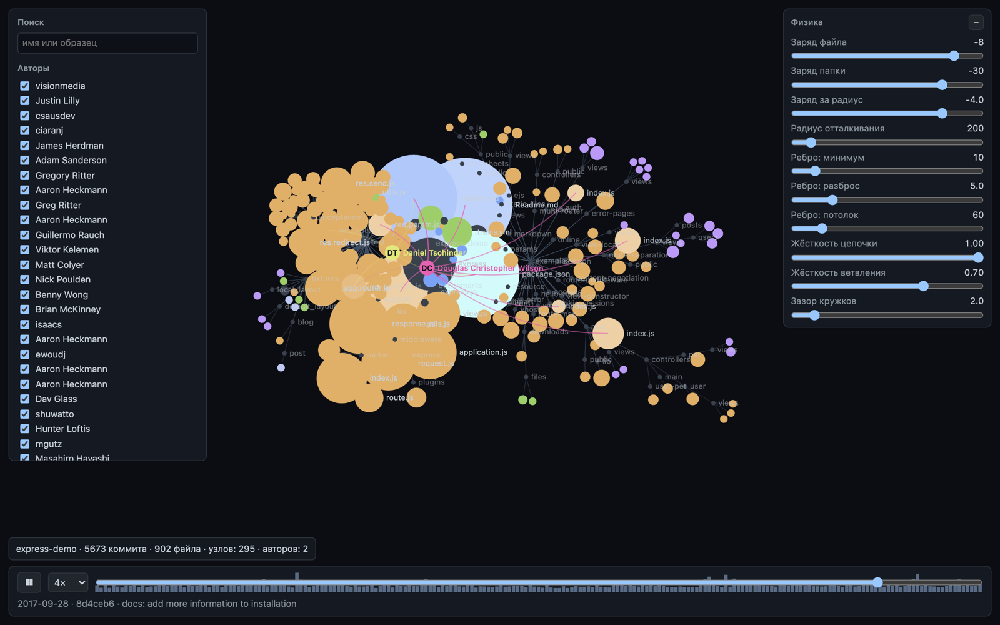

# paseka

Интерактивная визуализация истории git-репозитория в браузере.

[](https://github.com/joezavtra/paseka/actions/workflows/ci.yml)
[](LICENSE)
[](https://nodejs.org)

<p align="center">
  
</p>
<p align="center"><em>История <a href="https://github.com/expressjs/express">expressjs/express</a>: 5673 коммита, 390 авторов, 902 файла. Читается за 0.7 секунды.</em></p>

> **Note (English).** The UI, CLI output, code comments and documentation are in
> Russian only; English UI is not planned for 0.x. What it does: renders a local
> git repository's history as an interactive, force-directed tree in your
> browser. Run `npx github:joezavtra/paseka` inside any repository. Nothing
> leaves your machine — no video export, no telemetry, the server binds to
> `127.0.0.1` only.

## Что это

Одна команда в папке репозитория — и открывается вкладка с деревом файлов,
которое растёт по мере воспроизведения истории. Коммиты идут во времени, от
значков авторов бьют лучи к файлам, которых они касаются, задетые файлы
вспыхивают, папки живут силовой раскладкой. Размер узла — число коммитов в файл,
так что видно, где кипит работа, а не где просто много строк.

Дерево можно не только смотреть, но и трогать: перематывать, фильтровать по
авторам, путям и расширениям, искать, сворачивать и скрывать поддеревья,
открывать карточку файла с его историей и крутить параметры физики вживую.

## Чем отличается от gource и CodeFlower

|  | [gource](https://gource.io) | [CodeFlower](https://github.com/fzaninotto/CodeFlower) | paseka |
|---|---|---|---|
| Носитель | нативное приложение | страница | вкладка браузера из CLI |
| Время | анимация и рендер видео | нет, статичный срез | курсор по коммитам: пауза, скорость, перемотка |
| Взаимодействие | камера | наведение | камера, фильтры, поиск, карточка узла, видимость поддеревьев, настройка физики |
| Запуск | установка пакета | скопировать себе | одна команда в папке репозитория |
| Запись видео | да | нет | нет, осознанно |

Короче: из gource взято ощущение растущего организма, из CodeFlower — читаемая
структура. Отличие от обоих в том, что это инструмент для разглядывания, а не
рендерер роликов.

## Быстрый старт

```bash
npx github:joezavtra/paseka             # текущая папка
npx github:joezavtra/paseka ~/src/foo   # любой репозиторий
npx github:joezavtra/paseka --stats     # только сводка в терминал, без браузера
```

Флаги: `--port <n>` (по умолчанию 7420), `--no-open`, `--stats`, `--help`.

## Требования

Node 22 или новее, `git` в `PATH`, браузер с Canvas 2D. Проверено на macOS и
Linux; Windows должен работать, но в CI не проверяется.

## Приватность

Сервер слушает только `127.0.0.1`. История читается локальным `git log`, никуда
не отправляется, сеть не используется, телеметрии нет. У пакета ноль зависимостей
времени выполнения.

## Что умеет

- **Воспроизведение истории** — пауза, скорость до 8 коммитов в секунду,
  перемотка по слайдеру с гистограммой активности под ним.
- **Авторы** — значок с инициалами и лучи к файлам, которых автор касается прямо
  сейчас; цвет выводится из почты и не совпадает с цветами файлов.
- **Фильтры** — по авторам, образцу пути и расширениям. Фильтр **гасит**
  непопавшее, а не скрывает: дерево остаётся целым, и видно, где в нём живёт
  найденное.
- **Поиск** (`/`) — обводит совпадения по мере набора, Enter уводит камеру к
  первому. Поиск не отменяет фильтр: погашенное остаётся погашенным.
- **Видимость поддеревьев** — папку можно скрыть совсем (уходит из симуляции) или
  свернуть в один узел, который растёт по спрятанному объёму и в который бьют
  лучи авторов, работавших внутри.
- **Карточка узла** — по клику: путь, размер, дата рождения, топ авторов,
  спарклайн активности и последние коммиты, всё на текущем положении курсора.
- **Подписи** — у папок всегда, у крупных файлов, у найденного и у наведённого;
  имя изменённого файла вспыхивает вместе с ним.
- **Настройки физики** — тринадцать ползунков: заряды, длина и жёсткость рёбер,
  разведение, остывание. Меняются вживую и переживают перезагрузку.
- **`--stats`** — сводка по репозиторию в терминал, без браузера.

## Как устроено

`git log --raw --numstat` читается потоковым парсером, история сворачивается в
модель (пулы строк, типизированные массивы, CSR-индексы — никаких объектов на
элемент), модель упаковывается в бинарный формат и отдаётся локальным сервером в
браузер. Там движок времени держит живое множество и размеры на текущем коммите,
силовая раскладка (d3-force) крутится в Web Worker, а отрисовка идёт на Canvas 2D.

Подробности и обоснование решений — [docs/design.md](docs/design.md).

## Статус

0.1.0, ранняя версия. Публичного API нет, бинарный формат может меняться без
церемоний. Рассчитано на историю до ~50 000 коммитов; замерено на 5673 коммитах
и 902 файлах — 0.7 секунды на чтение и сборку.

Чего пока нет: экспорта самодостаточного HTML, watch-режима, отслеживания
переименований, фильтрации флагами CLI, записи видео, английского интерфейса.

## Сборка из исходников

```bash
git clone https://github.com/joezavtra/paseka.git
cd paseka
npm ci
npm run build
node dist/node/cli/main.js .
```

Проверки: `npm run typecheck`, `npm test` (541 юнит-тест), `npm run test:e2e`
(сквозные, нужны `npx playwright install chromium` и собранный `dist/web`).

Как участвовать и какие в проекте соглашения — [CONTRIBUTING.md](CONTRIBUTING.md).

## Документация

- [docs/design.md](docs/design.md) — архитектура и принятые решения.
- [docs/history/](docs/history/README.md) — исходные планы реализации: запись
  хода разработки с обоснованиями, зачем сделано именно так.

## Лицензия

MIT, см. [LICENSE](LICENSE). Собранный браузерный бандл включает
[d3-force](https://github.com/d3/d3-force) (ISC, © Mike Bostock).
